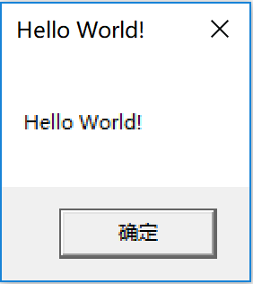
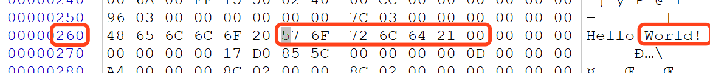
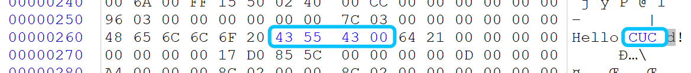
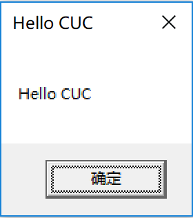

# 实验要求
- 编写一个release版本的 hello world 程序。通过修改程序可执行文件的方式（不是修改源代码），使得程序运行后显示的内容不为hello world，变成 hello cuc！
- 提示：一定要在编译选项中将调试信息相关的编译连接选项去掉，否则程序体积会比较大，而且存在很多“干扰”信息。

# 实验思路
- 将一个字符串改成一个另一个不长于它的字符串, 直接原地修改即可. 修改时注意末尾需有`\x00`

# 实验过程
## Part1. 生成原始程序
- 首先创建`tiny.c`并写入以下内容:
	```c
	#include <windows.h>

	int main() {
		MessageBoxA(NULL, "Hello World!", "Hello World!", NULL);
		ExitProcess(0);
	}
	```
- 另外为了方便编译链接, 创建`compile.bat`并写入以下内容:
	```
	cl /c /O1 tiny.c
	link /nologo /ENTRY:main /NODEFAULTLIB /SUBSYSTEM:WINDOWS /ALIGN:16 tiny.obj user32.lib kernel32.lib
	```
- 执行`compile.bat`以生成`tiny.exe`, 执行一下可以发现程序运行符合预期  
	
- 将`tiny.exe`拷贝为`tiny1.exe`

## Part2. 找指针
- 执行`dumpbin /DISASM tiny1.exe`, 结合一点汇编知识可以看出红框里的部分正是源码中`MessageBoxA`函数的传参与调用, 那么很明显待修改的字符串的地址即是`400260h`  
	

## Part3. 改指针
- 使用Winhex打开`tiny1.exe`, 找到地址`260`, 将这里的字符串改为`CUC`并在末尾添加`\x00`作为字符串结束符
	- 修改前:  
		  
	- 修改后:  
		
- 修改完毕后, 保存, 退出

# 实验结果
- 执行`tiny1.exe`, 发现对话框中的字符串已经发生变化  
	