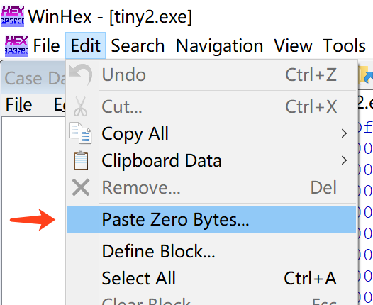
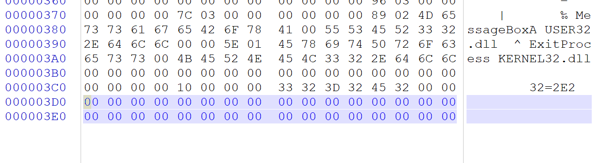
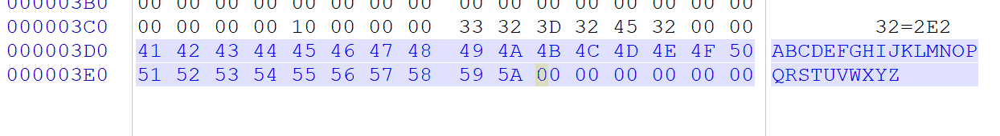
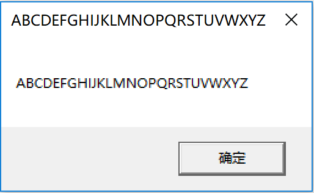

# 实验要求
- 上一题的程序中，修改的显示内容变为一个很长的字符串（至少2kb长）。并且保证程序正常运行不崩溃。
提示，可执行文件中原有的空间有限，必须要新加入数据，加入数据后必须要修改.text字段中的指针

# 实验思路
- 由于是将短字符串改为长字符串, 所以我们不能在原地进行操作, 需要给长字符串另外找一段空间来存放. 最正确的做法应该是修改节表与相应的节的内容等等, 但其实操作系统并没有那么严, 我们直接在文件尾部追加出这段空间来就可以了

# 实验过程
- 拷贝上一题的`tiny.exe`为`tiny2.exe`并使用Winhex打开
- 在文件尾部追加一段额外空间. 方法很多, 可以使用Winhex的"Paste Zero Bytes"功能来实现这一步  
	
- 使用上述方法追加完毕后可以看到以蓝色字体标注的额外空间  
	
- 随后在这里给出我们的长字符串, 剩下的步骤就和实验1一样了
	

# 实验结果
- 
