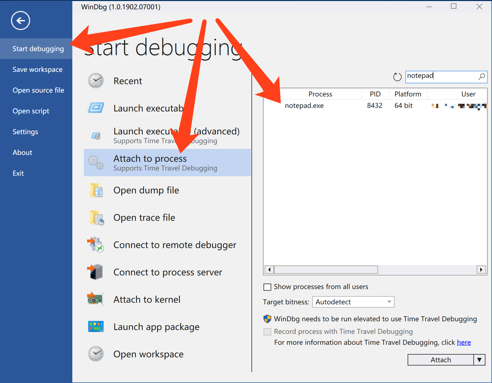
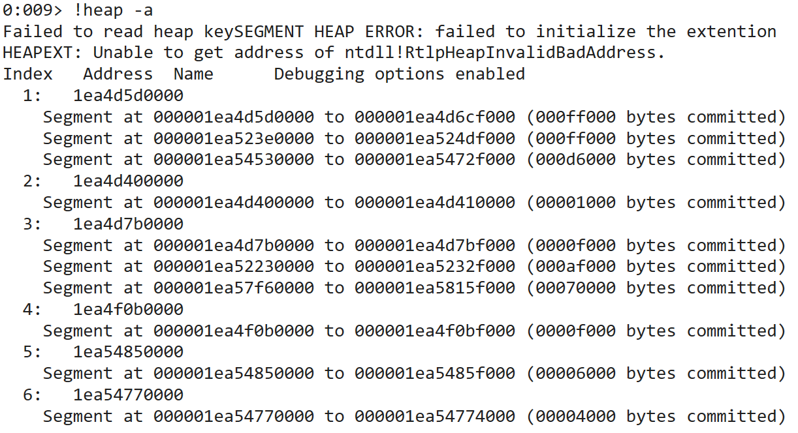

# 实验要求
- 在notepad（32位64位均可）中，输入一段文字。然后使用调试器，在内存中修改这段文字。使得没有在界面操作notepad的修改文字的情况下。notepad中显示的文字变化。
- 提示，在调试器中定位控件缓存的内存地址，可以用搜索、逆向、消息截获分析、API截获分析等方法。


# 实验思路
- 在nodepad中输入的文字应该会存在nodepad进程的堆内存中. 借助调试器, 我们查看堆内存的内容, 搜索我们输入的字符串, 定位到那块内存后修改内存中的内容即可
- 这里我们使用的调试器是Windbg

# 实验过程
- 打开nodepad, 随便输入一段内容  
	
- 打开Windbg, 选择附加到进程, 然后选择`notepad.exe`  
	
- 使用`!heap -a`指令查看该进程的堆信息  
	
- 可以看到当前进程有6个堆(有的堆分为多个片段), 由于不知道我们的字符串在其中哪一个堆里, 所以只能一个一个找. 这里手动找一下, 从第一个堆的第一个片段开始. 从上面的信息我们可以看到第一个堆的第一个片段的起始地址为`1ea4d5d0000`, 长度为`ff000`字节. 使用`s -u`指令在这段内存空间搜索我们给定的字符串  
	```
	0:009> s -u 1ea4d5d0000 Lff000 "这是一段测试文本"
	000001ea`4d60fda0  8fd9 662f 4e00 6bb5 6d4b 8bd5 6587 672c  ../f.N.kKm...e,g
	```
- 可以看到有一个搜索结果, 其地址为`1ea4d60fda0`. 我们使用`ezu`指令修改这段内存为其他的内容. 修改完毕后可以用`du`指令检查一下修改是否成功  
	```
	0:009> ezu 1ea`4d60fda0 "abcedfghijklmn  "
	0:009> du 1ea`4d60fda0
	000001ea`4d60fda0  "abcedfghijklmn  "
	```
	可以看到, 修改确实已经成功

# 实验结果
- 执行`g`指令, 使进程继续运行. 回到notepad界面, 发现notepad中的文本已经变成了我们修改的内容  
	