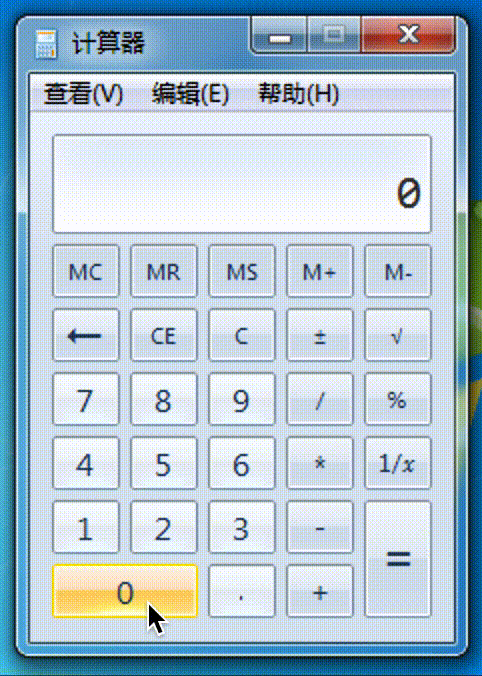

# 实验要求
- 通过调试器监控计算器程序的运行，每当运行结果为666时，就改为999。
- 提示：找到运行结果在内存中保存的地址。监控 “=” 按键消息等。

# 实验思路
- 对于对运行结果的修改, 可以通过给`SetWindowTextW`函数下断点来实现. 查原型可得第二个参数即为要显示的内容, 所以我们在其每次被调用前判断或修改第二个参数的值, 即可实现运行结果的修改
- 对于对等号按钮的监控, 可以通过`SetWindowLong`函数来修改消息处理函数. **这一步暂未实现**.

# 实验过程
- 启动32位的计算器
- 启动`Windbg`, 附加至计算器进程
- 由于`Windbg`中无法直接进行字符串判断, 所以我们需要设置"别名". 因此导致断点指令过长, 所以我们可以将用到的指令存为脚本. 新建一个文本文档(比如`C:\Windbg Scripts\4.txt`)并写入以下内容:  
	```
	as /mu ${/v:lpString} poi(esp+8)  
	.if($scmp(@"${lpString}","666")==0){ezu poi(esp+8) "999";}
	g
	```
- 回到`Windbg`, 执行以下命令以设置断点:  
	`bp SetWindowTextW "$<C:\\Windbg\ Scripts\\4.txt"`
- 执行`g`以使计算器继续运行

# 实验结果
