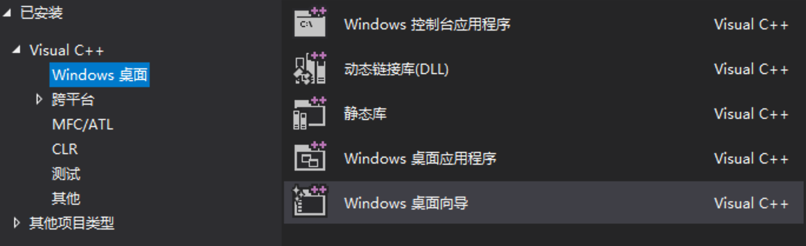
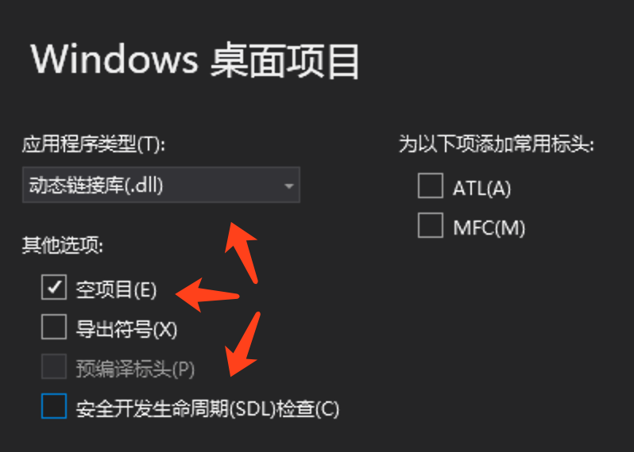
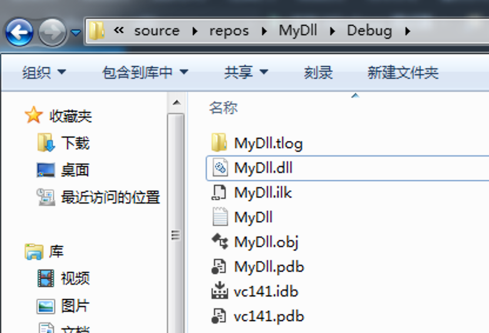
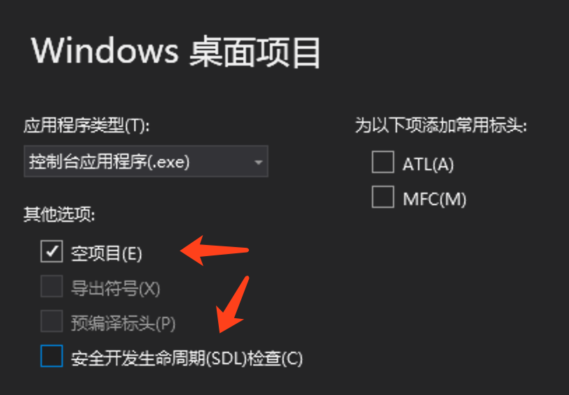
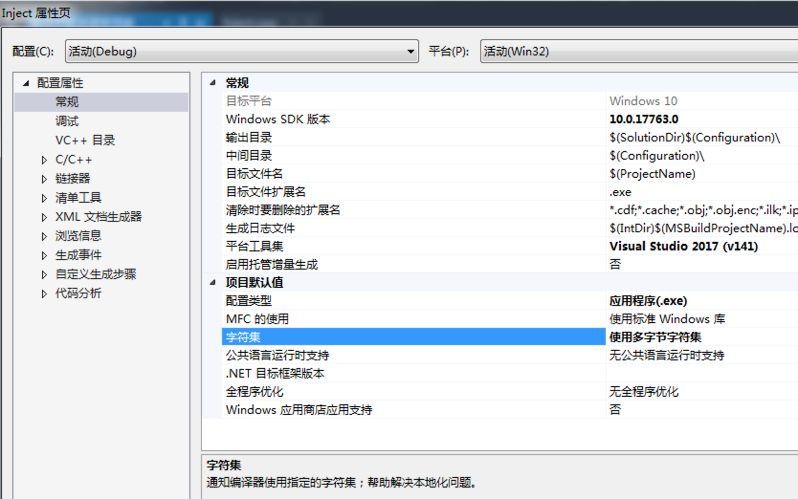

# Part1 远程注入
- `windows.h`提供了各种函数, 其中就包括了"在远程进程中创建线程"这样的函数. 但我们必须提供线程函数的地址, 而且这个地址必须能被受害者进程访问到. 所以我们把函数写在自己的攻击者程序里, 让受害者进程来攻击者进程的内存空间里执行这个攻击函数是不行的.
- 因此我们需要借助`.dll`. `.dll`可以在源代码层面设置当本DLL被加载时执行什么内容, 而且把攻击函数写在`.dll`里再让受害者进程加载这个`.dll`是可行的. 这就是我们要实现的方案.
- 下面通过"在计算器进程中调用一次MessageBoxA"来作为例子

# 实验要求
- 通过远程注入来在`calc.exe`进程中调用一次`MessageBoxA`

# 实验思路
- 注入的过程应该是这样:
	- 枚举进程得到`calc.exe`对应进程的PID
	- 根据PID获取进程句柄
	- 在进程中分配空间
	- 将函数参数(即`C:\\MyDll.dll`)写到刚刚分配的空间中
	- 获取`LoadLibraryA`函数的地址(其所在的`kernel32.dll`已经在内存中了所以无需加载直接取地址即可)
	- 在目标进程中根据函数地址与函数参数地址创建线程
	- 等待远程线程执行完毕
- 而远程线程其实就是一个`LoadLibraryA("C:\\MyDll.dll")`, 所以如果以上几步成功, 则`MyDll.dll`想干嘛就能干嘛了
- 而它想`MessageBoxA`

# 实验过程
- 注: 以下所有`.exe`与`.dll`均为32位版本(或者都是64位版本也行, 只要统一即可)
- 注: 除非你确定自己的操作OK, 否则请尽量保证所有步骤和文本相同, 不要给自己徒增失败的几率
- 环境:
	- `Windows 7`
	- `Visual Studio 2017`(下文简称`VS`)
- 下面是我个人的操作步骤

## 1. 生成MyDll.dll
- 打开`VS`, 新建一个`Windows 桌面向导`  
	  
	项目名称写`MyDll`, 并且去掉右边`为解决方案创建目录`的勾, 然后点下一步
- 如图设置  
	  
	设置好后点确定
- 添加源文件[MyDll.cpp](MyDll.cpp)
- `DllMain`是`.dll`文件的入口函数. 很多情况下都会调用这个函数, 包括加载时. 因加载而调用时, `dwReason`参数的值为`DLL_PROCESS_ATTACH`. 所以通过一个`switch`, 我们就能让`MessageBoxA`只在该`DLL`最开始被加载时调用
- 保存, 生成该项目(注意只是生成不是执行). 生成时不应该有任何警告. 生成成功时我们可以在项目根目录下得到一个`MyDll.dll`文件  
	  
	为了方便之后能通过绝对路径访问到这个`.dll`, 我们可以将其移到一个比较外面的位置, 比如`C:\MyDll.dll`

## 2. 生成Inject.exe
- 打开`VS`, 新建一个`Windows 桌面向导`. 项目名称写`Inject`, 并且去掉右边`为解决方案创建目录`的勾, 然后点下一步
- 如图设置  
	  
	设置好后点确定
- 在**项目**属性中修改字符集为多字节字符集  
	  
	设置好后点确定
- 在源文件中添加[Inject.cpp](Inject.cpp)
- 保存

# 实验结果
- 先运行32位计算器(一般在`C:\Windows\SysWOW64\calc.exe`)
- 再运行`Inject.exe`(这里为了方便演示将`.exe`移至了C盘根目录下)  
	
