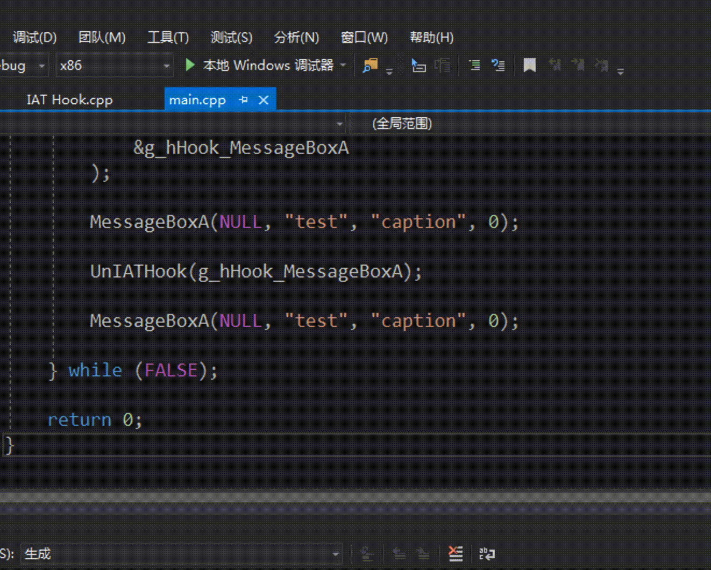

# Part2 本地IAT Hook
- IAT, import address table, 导入表. IAT Hook, 顾名思义, 就是在导入表下钩子, 让某受害者进程在调用某个函数时跳转至我们给定的攻击函数. 一般来说为了完成原有的功能, 我们需要在攻击函数里再调用原来的函数. 我们可以在对原来的函数的调用开始前或调用结束后做手脚来实现我们的攻击目的
- 本实验会用到[IATHook.cpp](IATHook.cpp)与[main.cpp](main.cpp)两个文件. 其中`IATHook.cpp`是具体实现, `main.cpp`算是一个使用示例. 目前暂时不对`IATHook.cpp`中的代码逻辑做具体解释, 以后有空再补上

# 实验要求
- 在本地完成`IAT Hook`

# 实验思路
- (留空, 日后补充)

# 实验过程
- 参照[part1.md](../1/part1.md)新建一个exe工程
- 添加源文件[IATHook.cpp](IATHook.cpp)与[main.cpp](main.cpp)
- 编译执行

# 实验结果
