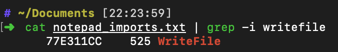

# Part3 远程IATHook

# 实验要求
- 通过API hook的方法，在每次notepad保存txt文件时，就将文件内容修改为： “you have been hacked!”
API hook 的关键是编写一个假函数，用假函数的指针替换IAT中真函数的指针（当然这种方式只能对通过IAT调用的管用，但是够了。）在假函数调用真函数，修改真函数的参数和返回的数据，将修改后的数据返回给调用者。

# 实验思路
- 有了[part1](../part1/part1.md)与[part2](../part2/part2.md)的背景知识, 这个题终于能做了
- 远程IATHook, 说白了就是通过远程注入的方式在受害者进程中执行IATHook. 将前两个部分的核心代码串在一块即可
- 目前唯一没有解决的问题就是我们还不知道`notepad.exe`保存文件时会调用什么API, 不过猜测可能会包含`write`,`file`这样的关键字. `dumpbin`取导入表再拿到有`grep`的地方`grep -i writefile`一下即得函数名  
	  
	查一下MSDN可知多半就是这个函数了
	  
	顺便函数原型也有了(函数原型在编写假函数时会用到)

# 实验过程
- 仿照[假MessageBoxA](../part2/main.cpp#L16)的写法编写[假WriteFile](HookWriteFile.cpp#L16), 并[将IATHook函数放在.dll的加载时执行](HookWriteFile.cpp#L46)
- 参照[part1](../part1/part1.md)的方法编译生成`HookWriteFile.dll`
- 相应修改注入函数, 使其向[notepad.exe](Inject.cpp#L7)中注入[HookWriteFile.dll](Inject.cpp#L6)
- 编译, 但不执行. 编译好后启动32位的`notepad.exe`, 然后再执行

# 实验结果
