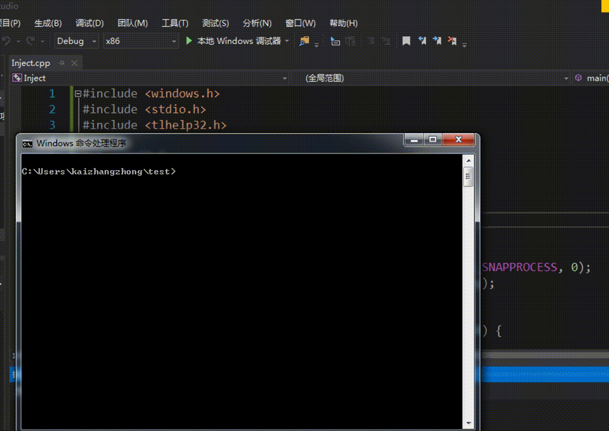

# 实验要求
- 通过API hook的方法，使得cmd的dir命令看不到任意目录下的hacker.exe 
首先需要分析dir是通过什么API的调用来遍历目录的，然后hook相关函数。

# 实验思路
- 首先查看32位`cmd.exe`导入表发现相关函数可能有以下几个:
	- `FindFirstFileW`
	- `FindFirstFileExW`
	- `FindNextFileW`
- 使用`Windbg`下断点调试发现, 执行`dir`指令时会按顺序调用1次`FirstEx`与若干次`Next`. 这就是我们要Hook的函数了.
- 注意下`FindFirstFileExW`与`FindNextFileW`的调用方式即可

# 实验过程
- 参照[第5次实验](../5)的DLL源码, 改写为本次实验所用到的[HookFindFileW.cpp](HookFindFileW.cpp)
- 注入程序仍然沿用[Inject.cpp](../5/part3/Inject.cpp), 修改一开始的两个参数即可

# 实验结果
