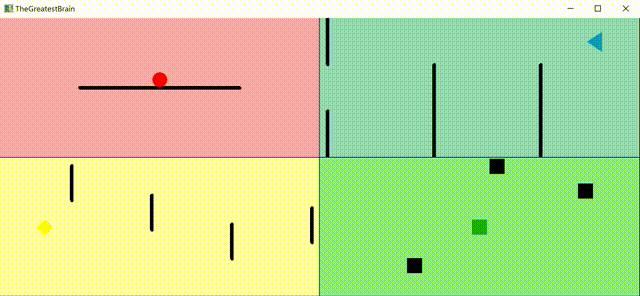

# 软件与系统安全大作业

# 零. 课题简介
- 该大作业将以大一暑期实践时使用C语言编写的小游戏([→Github源代码](https://github.com/TheMasterOfMagic/TheGreatestBrain))([→编译好的可执行文件](./TheGreatestBrain.exe))为受害者程序, 在**脱离源代码**的前提下, 尝试逆向分析受害者程序, 通过DLL注入与远程线程启动的方式执行任意代码以实现**自动操作**, 从而模拟一次外挂制作的过程
- 受害者程序通过`Visual Studio 2017 Community`在`Release X86`模式下禁用所有优化后编译生成
- 游戏简介: 游戏分为<font style="color:red">红</font><font style="color:yellow">黄</font><font style="color:cyan">蓝</font><font style="color:lightgreen">绿</font>4个子游戏. 玩家需同时操作4个子游戏避开障碍物以坚持尽可能长的时间. 每个子游戏单独来看都很简单, 但4个子游戏同时操作则有一定难度

# 一. 实验思路
- 首先要提取反汇编代码. 通过`Visual Studio`自带的开发人员工具执行
    ```cmd
    dumpbin /DISASM TheGreatestBrain.exe > asm.txt
    ```
    得到反汇编结果[disasm.txt](./disasm.txt). 在其中我们可以提取出所有的函数名全局变量名, 以及这些函数与变量的地址
    ```bash
    grep -v "__" asm.txt | grep -o "^_[^:]\+" | sort -u  # 提取所有函数名
    grep -v "__" asm.txt | grep -o "\[_[^]+-]\+\]" | sort -u  # 提取所有全局变量名
    ```
- 进一步观察, 可以发现游戏通过用计时器触发的`OnTimer`函数进行逻辑处理与数据更新, 所以我们的思路是`hook`该函数的入口点, 令其跳转至我们希望执行的代码, 最后再跳转回去. 即我们预期的效果是
    - `OnTimer`函数被调用
    - 调用后立刻跳转并执行我们的攻击代码
    - 执行完后再跳转回去执行原来需要执行的代码
- 进一步分析, 由于我们需要在函数入口覆盖一段长度为5个字节的`jmp`指令, 所以我们需要将被覆盖的内容事先拷贝出来留待稍后使用, 将此记作`szOldEntry`. 当我们的攻击代码执行完后, 我们再跳转并执行`szOldEntry`
    - 为了使`szOldEntry`执行完毕后能够跳转回原函数, 我们需要在`szOldEntry`之后再加5个字节的`jmp`指令
    - 为了降低攻击代码的编写难度, 我直接将其编写为C函数. 而为了实现"在原函数入口点跳转执行该攻击函数"的效果, 我额外写了一个10字节的`szCode`. 其作用是先调用攻击函数(5字节), 再跳转至`szOldEntry`(5字节).
- 所以分析下来, 原函数被调用后, 接下来的流程应该是:
    - 从原函数入口跳转并执行`szCode`
    - `szCode`调用攻击函数, 攻击函数正常执行然后返回至`szCode`中的下一条指令, 即跳转并执行`szOldEntry`
    - `szOldEntry`正常执行, 然后跳转至原函数中对应的位置, 原函数继续执行

# 二. 实验步骤
- 首先做一些准备工作, 比如获取进程基地址, 以及编写一些工具函数等
- 获取`OnTimer`函数的地址
    ```c
    void* pOnTimer = p(0x16E0);
    ```
    这里工具函数`p`的作用就是将相对地址转换为绝对地址(其实就是加了个基地址而已)
- 拷贝原函数入口点
    ```c
    BYTE* szOldEntry = (BYTE*)malloc(7 + 5);
	memcpy(szOldEntry, pOnTimer, 7);
	memcpy(szOldEntry + 7, "\xE9", 1);
	setAddress(szOldEntry + 8, (int)pOnTimer + 7 - ((int)szOldEntry + 12));
    ```
    其中工具函数`setAddress`的作用是将给定的32位地址以正确的顺序放入给定的内存空间中
- 上面有些需要注意的地方, 比如
    - `szOldEntry`的空间通过`malloc`函数分配, 否则`szOldEntry`所在内存页的权限无法被修改, 导致在执行时冲突. 使用`malloc`分配的空间可以在后续使用`VirtualProtect`函数进行修改
    - 为什么`malloc`的大小是7+5而不是5+5, 这是为了保持机器指令完整不被截断
    - 计算`E9 jmp`指令所使用的相对地址时, 注意起始地址是**当前指令下一条指令的地址**
- 接下来编写攻击函数`void target();`, 这里不展开叙述, 简单来说就是根据相应的数据再合适的时候模拟按下对应的按键以实现自动操作. 攻击函数`target`本身不难, 难的是把它用起来
- 然后制作`szCode`
    ```c
    BYTE* szCode = (BYTE*)malloc(5+5);
	memcpy(szCode, "\xE8", 2);  // call
	setAddress(szCode + 1, (int)target - ((int)szCode + 5));
	memcpy(szCode + 5, "\xE9", 1);
	setAddress(szCode + 6, (int)szOldEntry - ((int)szCode + 10));
    ```
    可以看到, `szCode`就由1条对攻击函数`target`的`call`和1条对`szOldEntry`的`jmp`组成
- 同样的, `E8 call`指令所使用的相对地址在计算时也要以当前指令下一条指令的地址为跳转的起始地址
- 之后制作用于覆盖原入口点的`szNewEntry`
    ```c
	BYTE szNewEntry[5];
	memcpy(szNewEntry, "\xE9", 1);
	setAddress(szNewEntry + 1, (int)szCode - ((int)pOnTimer + 5));
    ```
    值得一提的是, `szNewEntry`中的指令本身就是要拷贝到原函数中去执行的, 所以不需要使用`malloc`来分配空间
- 最后使用`VirtualProtect`修改所有需要修改的权限
    ```c
    DWORD flOldProtect;
	VirtualProtect(pOnTimer, sizeof(szNewEntry), PAGE_EXECUTE_READWRITE, &flOldProtect);
	VirtualProtect(szCode, 10, PAGE_EXECUTE_READWRITE, &flOldProtect);
	VirtualProtect(szOldEntry, 12, PAGE_EXECUTE_READWRITE, &flOldProtect);
    ```
    然后用`szNewEntry`覆盖函数入口
    ```c
    memcpy(pOnTimer, szNewEntry, sizeof(szNewEntry));
    ```

# 三. 实验结果
- 可以看到, 在程序的自动控制下, 游戏里出现各种极限操作(比如擦边躲障碍等)

- 如此, 我们便通过`远程函数执行`+`DLL注入`的方式`hook`了我们的目标函数, 并在攻击代码中进行了自动操作, 实现了动图中的效果

# 四. 源代码
- 注入程序: [Inject.cpp](./Inject.cpp)
- DLL: [MyDll.cpp](./MyDll.cpp)